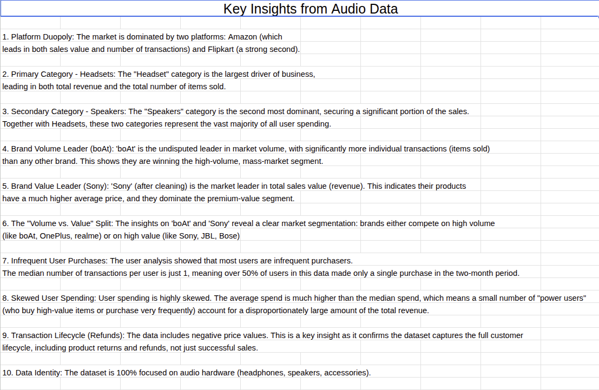

# E-commerce Audio Hardware Sales Analysis

## 1. Project Overview

This project is a comprehensive analysis of a 2-month e-commerce transaction dataset (21,000+ rows) for audio hardware. The primary goal was to clean the raw data, perform exploratory data analysis (EDA) to identify sales trends, and present key business insights in a final dashboard.

*Tools Used:* Google Sheets, Microsoft Excel, Pivot Tables, Data Cleaning & Transformation, Data Visualization

---

## 2. Data Cleaning

The raw 21,000-row dataset was unworkable and required significant cleaning. My data transformation process involved:

* *Duplicate Removal:* Identified and removed over 1,800 duplicate transaction entries.
* *Missing Value Imputation:* Filled missing categorical data (level2_name and level3_name) with "Unknown" to preserve row integrity for financial analysis.
* *Categorical Standardization:* Corrected data entry errors by merging inconsistent brand names (e.g., "SONY" and "Sony" were consolidated).
* *Data Type Correction (Critical):* Diagnosed and fixed the price column, which was incorrectly formatted as text due to hidden commas (e.g., "1,898.00"). This was resolved using Find & Replace and re-formatting the column as numeric, making it possible to perform aggregations.
* *Irrelevant Data Removal:* Removed 4 columns (pincode, city, state, country) with over 70% missing values that were not relevant to the analysis.

The final clean dataset consists of 19,162 unique, accurate transactions.

---

## 3. Exploratory Data Analysis (EDA) & Key Insights

I used Pivot Tables to analyze the clean data from multiple perspectives. The key insights included:

1.  *Platform Duopoly:* The market is dominated by Amazon (60.1% of revenue) and Flipkart (36.5%).
2.  *Category Concentration:* 99.8% of all sales are either *Headsets (54.5%)* or *Speakers (45.3%)*.
3.  *The "Volume vs. Value" Split (Key Insight):*
    * *Volume Leader:* *boAt* is the undisputed leader in units sold (3,300+ transactions).
    * *Value Leader:* *Sony* is the market leader in total sales revenue (over ₹11.2M), indicating a much higher average price.
4.  *User Spending Patterns:* User spending is highly skewed, with a small number of "power users" driving a significant portion of the total revenue.

---

## 4. Final Dashboard

I created a summary dashboard in Google Sheets to visually communicate the key findings to stakeholders at a glance.

---

## 5. Business Recommendations

Based on the analysis, I formulated three data-driven recommendations:

1.  *For 'boAt' (Volume Leader):* Launch co-branded marketing campaigns and "bundle deals" (e.g., "Buy boAt headphones, get 20% off earpads") to increase average order value.
2.  *For 'Sony' (Value Leader):* Create "Premium Audio" landing pages featuring Sony products to cross-sell other high-margin items to high-value customers.
3.  *For Platform Strategy:* Focus all affiliate marketing and partnership efforts exclusively on Amazon and Flipkart to maximize ROI.